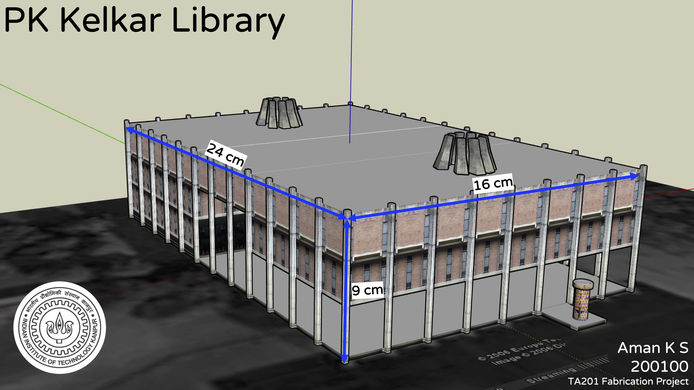

# TA201 Fabrication Project: PK Kelkar Library Model 
#### <a href="TA201-Fabrication-Project.pdf" rel="TA201-Fabrication-Project">TA201 Course Project</a>

Mentor: Prof. Sudhanshu Shekhar Singh, Dept. of Material Science Engineering, IIT Kanpur

• Designed a model of a PK Kelkar Library using Sketchup as part of the TA201 (Manufacturing Processes-I) course project.

• Employed manufacturing processes like Cutting, Bending, Brazing, Adhesive Joining to fabricate the PK Kelkar Library model.

